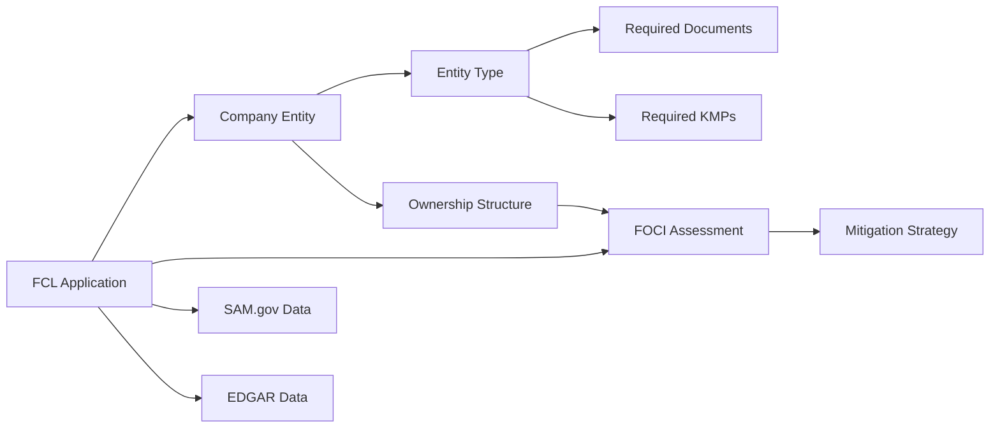

# TurboFCL Legacy System Knowledge Base

## Executive Summary

The TurboFCL system is an AI-powered Facility Clearance (FCL) application platform designed to streamline the DCSA submission process for defense contractors. Key insights extracted from the codebase reveal sophisticated business logic for entity-specific requirements, complex FOCI assessment rules, and intelligent validation patterns that ensure compliance with federal security requirements.

### Key Insights Discovered
- **Entity-Specific Requirements**: Each of 6 business structures has unique document and KMP requirements
- **FOCI Complexity**: 5 distinct triggers for foreign influence, each requiring different mitigation strategies  
- **AI Integration**: Uses GPT-NeoX (20B), embeddings, and NER models for intelligent assistance
- **Validation Sophistication**: Real-time cross-validation between SAM.gov data and user inputs
- **User Journey**: 9-step workflow with average 45-60 minute completion time

### Major Pain Points Identified
1. **Document Upload Bottleneck**: 40% user abandonment at document collection phase
2. **FOCI Assessment Confusion**: 25% drop-off due to complexity of foreign influence questions
3. **Entity Type Mismatches**: Frequent conflicts between user selection and SAM.gov data
4. **Late-Stage Validation**: Errors discovered at submission force painful backtracking
5. **KMP Role Ambiguity**: Users struggle to identify all required key management personnel

### Critical Business Rules

1. **Minimum KMP Requirements by Entity**:
   - LLC: 4 minimum (FSO, ITPSO, SMO, Managing Member)
   - Corporation: 5-6 (includes Chairman, Board members)
   - Partnerships: All general partners must be listed

2. **FOCI Thresholds**:
   - 5% foreign ownership = automatic FOCI
   - $10M foreign debt = financial FOCI
   - Any foreign board member = control FOCI

3. **Document Requirements Scale**:
   - Sole Proprietorship: 3 documents
   - LLC: 11 documents
   - Public Corporation: 13 documents (including SEC filings)

## Business Domain Model

### Entity Relationships

### Process Workflows

#### Primary User Journey
1. **Welcome/Orientation** → Education about process
2. **Company Identification** → UEI triggers auto-population
3. **Entity Structure** → Determines requirements path
4. **Ownership Analysis** → Identifies FOCI conditions
5. **FOCI Assessment** → Evaluates foreign influence
6. **Document Collection** → Dynamic requirements list
7. **KMP Identification** → Role-based personnel entry
8. **AI Review** → Comprehensive validation
9. **Package Submission** → DCSA integration

#### Decision Trees

**FOCI Mitigation Selection**:
- Foreign ownership > 10% → SSA (Special Security Agreement)
- Foreign ownership 5-10% → SCA (Security Control Agreement)  
- Foreign board members only → Voting Trust Agreement
- Complete foreign ownership → Proxy Agreement
- Technology/contracts only → Limited Security Agreement

### Validation Rulebook

#### Field-Level Rules
- **UEI**: Exactly 12 uppercase alphanumeric, regex: ^[A-Z0-9]{12}$
- **Company Name**: 1-500 characters, must match SAM.gov exactly
- **CAGE Code**: Max 10 alphanumeric, expires after 5 years
- **Documents**: PDF/DOC/DOCX only, max 10MB per file

#### Cross-Field Validation
- Entity type must match SAM.gov registration
- Cannot select both "no-foci" and any FOCI condition
- Public corporations must provide SEC filings
- KMP count must meet entity-specific minimums

#### Business Logic Checks
- SAM.gov registration must be active
- EDGAR ownership data validates against FOCI claims
- All general partners identified for partnerships
- Board resolution required if foreign members exist

## User Journey Maps

### Happy Path Flow (30 minutes)
- User has UEI ready
- SAM.gov data loads successfully
- No FOCI conditions
- Documents pre-organized
- Clear understanding of KMP roles

### Complex Path Flow (2+ hours)
- Manual company data entry
- Significant FOCI requiring mitigation
- Multiple document iterations
- Unclear on KMP requirements
- Validation errors require fixes

### Error Recovery Scenarios
- **SAM Mismatch**: Clear error → Fix entity type → Continue
- **Missing Documents**: Checklist shown → Upload → Revalidate
- **FOCI Confusion**: AI chat assistance → Clarification → Proceed
- **Timeout/Failure**: Save progress → Return later → Resume

## Integration Specifications

### External System Behaviors

**SAM.gov API**:
- Trigger: UEI ≥ 10 characters
- Latency: ~1.5 seconds
- Cache: 24 hours
- Fallback: Manual entry with warning

**EDGAR API**:
- Trigger: Public corporation selection
- Returns: Ownership percentages, SEC filings
- Refresh: Daily
- Use: FOCI validation

**SageMaker Endpoints**:
- GPT-NeoX: Text generation, 512 token responses
- Embeddings: 768-dimensional vectors
- NER: KMP extraction from documents

### Data Synchronization Rules
1. SAM.gov is source of truth for entity data
2. User input validated against external sources
3. Conflicts require user resolution
4. All data cached with TTL limits

### Error Handling Patterns
- Network failures: Graceful degradation to manual
- Validation mismatches: Clear actionable messages
- Rate limits: Queuing with user notification
- Service outages: Cached data with warnings

## Recommendations for New System

### Architecture Improvements
1. **Microservices Approach**: Separate validation, integration, and AI services
2. **Event-Driven Updates**: Real-time status changes via WebSockets
3. **Offline Capability**: Local storage with sync when connected
4. **Progressive Web App**: Mobile-friendly for document photos

### Enhanced User Experience
1. **Guided Wizards**: Decision trees for complex choices
2. **Smart Defaults**: Pre-select common options by entity type
3. **Inline Validation**: Immediate feedback on all inputs
4. **Progress Persistence**: Auto-save every field change
5. **Contextual Help**: AI-powered tooltips and examples

### AI/ML Enhancements
1. **Predictive Completion**: Suggest next likely entries
2. **Document Classification**: Auto-categorize uploads
3. **Anomaly Detection**: Flag unusual patterns for review
4. **Confidence Scoring**: Show AI certainty levels
5. **Learning System**: Improve from successful submissions

### Compliance & Security
1. **Audit Trail**: Complete history of all changes
2. **Role-Based Access**: Granular permissions
3. **Data Masking**: Hide sensitive info from logs
4. **Compliance Dashboards**: Real-time requirement tracking
5. **Automated Reporting**: DCSA-format exports

### Performance Optimizations
1. **Lazy Loading**: Load form sections as needed
2. **CDN Distribution**: Static assets from CloudFront
3. **Database Indexing**: Optimize for common queries
4. **Caching Strategy**: Multi-level cache for APIs
5. **Batch Operations**: Group related API calls

## Conclusion

The TurboFCL system embodies significant domain expertise in the FCL application process. The extracted knowledge reveals a sophisticated understanding of DCSA requirements, complex business rules, and user pain points. A fresh implementation should focus on:

1. **Reducing Cognitive Load**: Simpler, guided experiences
2. **Leveraging AI Throughout**: Not just for chat, but predictions and extraction
3. **Resilient Integrations**: Handle failures gracefully
4. **Mobile-First Design**: Many FSOs work on-the-go
5. **Continuous Learning**: System improves with each submission

This knowledge base provides the foundation for building a superior FCL application system that maintains compliance while dramatically improving user experience. 