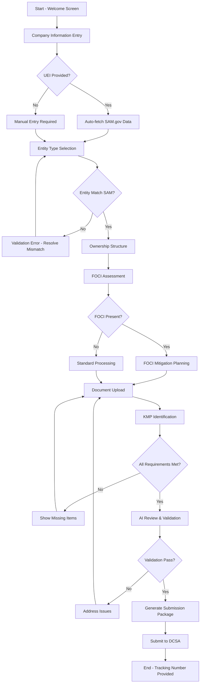

# Workflow: FCL Application Process

## Business Process Flow



## Key Decision Points

1. **Decision**: Auto-fetch SAM.gov data?
   - **Criteria**: UEI length >= 10 characters
   - **Outcomes**: 
     - Success: Pre-populate company data, validate entity type
     - Failure: Allow manual entry with warning

2. **Decision**: Entity type matches SAM.gov?
   - **Criteria**: Selected type aligns with SAM entityStructure
   - **Outcomes**:
     - Match: Proceed to ownership
     - Mismatch: Force correction with clear error message

3. **Decision**: FOCI conditions present?
   - **Criteria**: Any foreign ownership, control, or influence indicators
   - **Outcomes**:
     - FOCI: Require mitigation strategy selection
     - No FOCI: Standard FCL processing path

4. **Decision**: All requirements satisfied?
   - **Criteria**: Required documents uploaded, KMPs identified, validations pass
   - **Outcomes**:
     - Complete: Generate submission package
     - Incomplete: Show checklist of missing items

## Pain Points Identified

- Pain point 1: **Entity type confusion** - Users unsure which option matches their business structure
- Pain point 2: **FOCI complexity** - Many users don't understand what constitutes foreign influence
- Pain point 3: **Document naming** - Uploaded files often poorly named, making review difficult
- Pain point 4: **KMP role confusion** - Users unsure who qualifies as key management
- Pain point 5: **Validation timing** - Late-stage errors force users to backtrack

## Success Patterns

- Pattern 1: **Progressive disclosure** - Show only relevant fields based on previous selections
- Pattern 2: **Real-time validation** - Catch errors immediately rather than at submission
- Pattern 3: **Auto-save progress** - Users can return to incomplete applications
- Pattern 4: **Contextual help** - Tooltips and examples for complex fields
- Pattern 5: **Visual progress tracking** - Clear indication of completion status

## User Journey Steps

### Step 1: Welcome & Orientation (0-2 minutes)
- User sees value propositions (AI assistance, time savings)
- Clear call-to-action to start application
- Option to login or continue as guest

### Step 2: Company Identification (2-5 minutes)
- Enter company name and UEI
- System fetches SAM.gov data automatically
- Immediate feedback on data retrieval status

### Step 3: Entity Structure (5-8 minutes)
- Select from 6 entity types with descriptions
- System validates against SAM.gov data
- Shows required documents/KMPs for selected type

### Step 4: Ownership Analysis (8-12 minutes)
- Complex form for ownership percentages
- Questions about foreign connections
- FOCI assessment triggered by responses

### Step 5: Document Collection (12-25 minutes)
- Dynamic checklist based on entity type
- Drag-and-drop upload interface
- Real-time document processing status

### Step 6: Personnel Identification (25-35 minutes)
- Add KMPs with role selection
- Citizenship and clearance status
- AI assists in role identification

### Step 7: Review & Validation (35-40 minutes)
- AI performs comprehensive check
- Issues and recommendations displayed
- Opportunity to fix problems

### Step 8: Package Generation (40-45 minutes)
- System compiles all materials
- Generates cover sheets and indices
- Creates submission package

### Step 9: Submission (45-47 minutes)
- Final confirmation screen
- Submit to DCSA integration
- Receive tracking information

## Recommended Improvements

### 1. Reduce Cognitive Load
- Break complex forms into smaller chunks
- Use progressive disclosure extensively
- Provide decision trees for complex choices

### 2. Leverage AI Throughout
- Predictive text for company names
- Smart document classification
- Automated KMP extraction from org charts

### 3. Improve Error Recovery
- Save draft at every step
- Allow users to skip and return
- Provide clear paths to resolve issues

### 4. Enhanced Progress Visibility
- Visual timeline showing all steps
- Estimated time remaining
- Checklist of completed items

### 5. Streamline Document Handling
- Accept photos of documents for OCR
- Auto-rename files descriptively
- Batch upload capabilities

## Integration Touchpoints

### SAM.gov API
- Trigger: UEI entry (debounced)
- Frequency: On-demand with 24hr cache
- Fallback: Manual entry with warning

### EDGAR API
- Trigger: Public corporation selection
- Frequency: Daily refresh
- Purpose: Ownership verification

### SageMaker Endpoints
- Document processing: On upload
- Chat assistance: On demand
- Validation: Before submission

### DCSA Submission
- Trigger: Final submit action
- Format: Structured XML/JSON package
- Response: Tracking number

## Workflow State Machine

```yaml
States:
  INIT: "User lands on welcome page"
  COMPANY_INFO: "Entering basic company data"
  FETCHING_DATA: "Retrieving SAM.gov information"
  ENTITY_SELECT: "Choosing business structure"
  OWNERSHIP: "Defining ownership structure"
  FOCI_ASSESS: "Evaluating foreign influence"
  FOCI_MITIGATE: "Planning FOCI mitigation"
  DOCUMENT_UPLOAD: "Uploading required documents"
  KMP_ENTRY: "Identifying key personnel"
  AI_REVIEW: "System validation in progress"
  ISSUE_RESOLUTION: "Addressing validation issues"
  PACKAGE_PREP: "Generating submission materials"
  SUBMITTED: "Application sent to DCSA"

Transitions:
  INIT->COMPANY_INFO: "User clicks 'Start Application'"
  COMPANY_INFO->FETCHING_DATA: "Valid UEI entered"
  COMPANY_INFO->ENTITY_SELECT: "Skip SAM lookup"
  FETCHING_DATA->ENTITY_SELECT: "Data retrieval complete"
  ENTITY_SELECT->OWNERSHIP: "Valid entity selected"
  OWNERSHIP->FOCI_ASSESS: "Ownership data complete"
  FOCI_ASSESS->FOCI_MITIGATE: "FOCI conditions detected"
  FOCI_ASSESS->DOCUMENT_UPLOAD: "No FOCI present"
  FOCI_MITIGATE->DOCUMENT_UPLOAD: "Mitigation selected"
  DOCUMENT_UPLOAD->KMP_ENTRY: "Min documents uploaded"
  KMP_ENTRY->AI_REVIEW: "Min KMPs identified"
  AI_REVIEW->ISSUE_RESOLUTION: "Validation failures"
  AI_REVIEW->PACKAGE_PREP: "All validations pass"
  ISSUE_RESOLUTION->DOCUMENT_UPLOAD: "Need more documents"
  ISSUE_RESOLUTION->KMP_ENTRY: "Need more KMPs"
  PACKAGE_PREP->SUBMITTED: "User confirms submission"
```

## Timing Insights

- **Average completion time**: 45-60 minutes for prepared users
- **Abandonment points**: 
  - Document upload (40% drop-off)
  - FOCI assessment (25% drop-off)
- **Fastest path**: Users with UEI and documents ready - 30 minutes
- **Slowest path**: Complex FOCI situations - 2+ hours

## Compliance Checkpoints

1. **SAM.gov Active Status**: Block progression if registration expired
2. **Entity Type Alignment**: Prevent mismatched entity selection  
3. **FOCI Disclosure**: Require attestation of completeness
4. **Document Completeness**: Verify all required documents present
5. **KMP Identification**: Ensure minimum roles filled
6. **Pre-submission Review**: Final validation before DCSA submission 