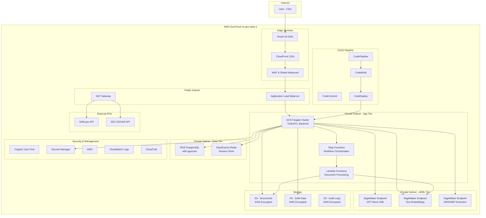

# TurboFCL GovCloud Deployment Architecture

## Executive Summary

This document provides a comprehensive deployment strategy for TurboFCL in AWS GovCloud (us-gov-west-1), integrating AI/ML capabilities through SageMaker, secure authentication, and automated CI/CD pipelines.

## Architecture Overview



## 1. Authentication & User Management

### Cognito User Pool Configuration

```json
{
  "UserPool": {
    "PoolName": "turbofcl-user-pool-gov",
    "Schema": [
      {
        "Name": "email",
        "AttributeDataType": "String",
        "Required": true,
        "Mutable": false
      },
      {
        "Name": "company_name",
        "AttributeDataType": "String",
        "Required": true,
        "Mutable": true
      },
      {
        "Name": "security_clearance",
        "AttributeDataType": "String",
        "Required": false,
        "Mutable": true
      },
      {
        "Name": "dcsa_facility_id",
        "AttributeDataType": "String",
        "Required": false,
        "Mutable": true
      }
    ],
    "Policies": {
      "PasswordPolicy": {
        "MinimumLength": 12,
        "RequireUppercase": true,
        "RequireLowercase": true,
        "RequireNumbers": true,
        "RequireSymbols": true,
        "TemporaryPasswordValidityDays": 1
      }
    },
    "MfaConfiguration": "REQUIRED",
    "EnabledMfas": ["SMS_MFA", "SOFTWARE_TOKEN_MFA"],
    "AdvancedSecurityMode": "ENFORCED"
  }
}
```

### Role-Based Access Control (RBAC)

```yaml
IAM_Roles:
  TurboFCL_FSO_Role:
    AssumeRolePolicyDocument:
      Statement:
        - Effect: Allow
          Principal:
            Federated: !GetAtt CognitoIdentityPool.Arn
          Action: sts:AssumeRoleWithWebIdentity
          Condition:
            StringEquals:
              cognito-identity.amazonaws.com:aud: !Ref CognitoIdentityPool
    Policies:
      - PolicyName: TurboFCL_FSO_Access
        PolicyDocument:
          Statement:
            - Effect: Allow
              Action:
                - s3:GetObject
                - s3:PutObject
              Resource: 
                - !Sub "${TurboFCLDocumentsBucket}/*"
            - Effect: Allow
              Action:
                - sagemaker:InvokeEndpoint
              Resource:
                - !GetAtt GPTEndpoint.EndpointArn
                - !GetAtt EmbeddingEndpoint.EndpointArn
            - Effect: Allow
              Action:
                - rds-data:ExecuteStatement
                - rds-data:BatchExecuteStatement
              Resource: !GetAtt TurboFCLDatabase.DBClusterArn
```

## 2. Database Configuration

### PostgreSQL with pgvector Setup

```sql
-- Database initialization script
CREATE EXTENSION IF NOT EXISTS pgvector;
CREATE EXTENSION IF NOT EXISTS pg_trgm;
CREATE EXTENSION IF NOT EXISTS btree_gin;

-- User management
CREATE TABLE users (
    id UUID PRIMARY KEY DEFAULT gen_random_uuid(),
    cognito_sub VARCHAR(255) UNIQUE NOT NULL,
    email VARCHAR(255) NOT NULL,
    company_name VARCHAR(500) NOT NULL,
    security_clearance VARCHAR(50),
    dcsa_facility_id VARCHAR(100),
    created_at TIMESTAMP WITH TIME ZONE DEFAULT NOW(),
    updated_at TIMESTAMP WITH TIME ZONE DEFAULT NOW()
);

-- FCL Applications
CREATE TABLE fcl_applications (
    id UUID PRIMARY KEY DEFAULT gen_random_uuid(),
    user_id UUID REFERENCES users(id),
    company_uei VARCHAR(12),
    cage_code VARCHAR(10),
    entity_type VARCHAR(100),
    sam_data JSONB,
    edgar_data JSONB,
    foci_status JSONB,
    validation_issues JSONB,
    ai_insights JSONB,
    status VARCHAR(50) DEFAULT 'draft',
    created_at TIMESTAMP WITH TIME ZONE DEFAULT NOW(),
    updated_at TIMESTAMP WITH TIME ZONE DEFAULT NOW()
);

-- Document embeddings for RAG
CREATE TABLE document_embeddings (
    id UUID PRIMARY KEY DEFAULT gen_random_uuid(),
    application_id UUID REFERENCES fcl_applications(id),
    document_name VARCHAR(500),
    document_type VARCHAR(100),
    chunk_text TEXT,
    embedding vector(768),  -- Assuming 768-dim embeddings
    metadata JSONB,
    created_at TIMESTAMP WITH TIME ZONE DEFAULT NOW()
);

-- Create indexes for vector similarity search
CREATE INDEX ON document_embeddings USING ivfflat (embedding vector_cosine_ops);
CREATE INDEX ON document_embeddings (application_id);
CREATE INDEX ON document_embeddings (document_type);

-- KMP tracking
CREATE TABLE key_management_personnel (
    id UUID PRIMARY KEY DEFAULT gen_random_uuid(),
    application_id UUID REFERENCES fcl_applications(id),
    full_name VARCHAR(500) NOT NULL,
    role VARCHAR(100) NOT NULL,
    citizenship_status VARCHAR(50),
    clearance_required BOOLEAN DEFAULT true,
    clearance_level VARCHAR(50),
    extracted_by_ai BOOLEAN DEFAULT false,
    created_at TIMESTAMP WITH TIME ZONE DEFAULT NOW()
);
```

### Database Environment Configuration

```yaml
# Parameter Store values
/turbofcl/database/username: turbofcl_app
/turbofcl/database/password: <SecureRandomPassword>
/turbofcl/database/endpoint: turbofcl-cluster.cluster-xyz.us-gov-west-1.rds.amazonaws.com
/turbofcl/database/port: 5432
/turbofcl/database/name: turbofcl

# RDS Cluster Configuration
RDSCluster:
  Engine: aurora-postgresql
  EngineVersion: "15.4"
  DatabaseName: turbofcl
  MasterUsername: !Ref DatabaseUsername
  MasterUserPassword: !Ref DatabasePassword
  BackupRetentionPeriod: 30
  PreferredBackupWindow: "03:00-04:00"
  PreferredMaintenanceWindow: "sun:04:00-sun:05:00"
  StorageEncrypted: true
  KmsKeyId: !Ref DatabaseKMSKey
  DeletionProtection: true
  DBSubnetGroupName: !Ref DBSubnetGroup
  VpcSecurityGroupIds:
    - !Ref DatabaseSecurityGroup
```

## 3. ECS Fargate Cluster Setup

### ECS Task Definition

```json
{
  "family": "turbofcl-backend",
  "networkMode": "awsvpc",
  "requiresCompatibilities": ["FARGATE"],
  "cpu": "1024",
  "memory": "2048",
  "executionRoleArn": "arn:aws-us-gov:iam::ACCOUNT:role/TurboFCL-ECS-ExecutionRole",
  "taskRoleArn": "arn:aws-us-gov:iam::ACCOUNT:role/TurboFCL-ECS-TaskRole",
  "containerDefinitions": [
    {
      "name": "turbofcl-backend",
      "image": "ACCOUNT.dkr.ecr.us-gov-west-1.amazonaws.com/turbofcl-backend:latest",
      "portMappings": [
        {
          "containerPort": 8000,
          "protocol": "tcp"
        }
      ],
      "environment": [
        {
          "name": "AWS_DEFAULT_REGION",
          "value": "us-gov-west-1"
        },
        {
          "name": "ENVIRONMENT",
          "value": "production"
        }
      ],
      "secrets": [
        {
          "name": "DATABASE_URL",
          "valueFrom": "arn:aws-us-gov:ssm:us-gov-west-1:ACCOUNT:parameter/turbofcl/database/url"
        },
        {
          "name": "COGNITO_USER_POOL_ID",
          "valueFrom": "arn:aws-us-gov:ssm:us-gov-west-1:ACCOUNT:parameter/turbofcl/cognito/user_pool_id"
        },
        {
          "name": "SAGEMAKER_GPT_ENDPOINT",
          "valueFrom": "arn:aws-us-gov:ssm:us-gov-west-1:ACCOUNT:parameter/turbofcl/sagemaker/gpt_endpoint"
        }
      ],
      "logConfiguration": {
        "logDriver": "awslogs",
        "options": {
          "awslogs-group": "/aws/ecs/turbofcl",
          "awslogs-region": "us-gov-west-1",
          "awslogs-stream-prefix": "ecs"
        }
      },
      "healthCheck": {
        "command": ["CMD-SHELL", "curl -f http://localhost:8000/health || exit 1"],
        "interval": 30,
        "timeout": 5,
        "retries": 3,
        "startPeriod": 60
      }
    }
  ]
}
```

### ECS Service Configuration

```yaml
ECSService:
  Type: AWS::ECS::Service
  Properties:
    ServiceName: turbofcl-backend-service
    Cluster: !Ref ECSCluster
    TaskDefinition: !Ref TaskDefinition
    DesiredCount: 2
    LaunchType: FARGATE
    NetworkConfiguration:
      AwsvpcConfiguration:
        SecurityGroups:
          - !Ref BackendSecurityGroup
        Subnets:
          - !Ref PrivateSubnet1
          - !Ref PrivateSubnet2
        AssignPublicIp: DISABLED
    LoadBalancers:
      - ContainerName: turbofcl-backend
        ContainerPort: 8000
        TargetGroupArn: !Ref ALBTargetGroup
    DeploymentConfiguration:
      MaximumPercent: 200
      MinimumHealthyPercent: 100
      DeploymentCircuitBreaker:
        Enable: true
        Rollback: true
    EnableExecuteCommand: true
```

## 4. SageMaker Integration

### Model Endpoints Configuration

```python
# deploy_models.py - SageMaker endpoint deployment
import boto3
import sagemaker
from sagemaker.huggingface import HuggingFaceModel

# GPT-NeoX for text generation
def deploy_gpt_model():
    huggingface_model = HuggingFaceModel(
        transformers_version="4.21.0",
        pytorch_version="1.12.0",
        py_version="py39",
        model_data="s3://turbofcl-models-gov/gpt-neox-20b/model.tar.gz",
        role="arn:aws-us-gov:iam::ACCOUNT:role/TurboFCL-SageMaker-ExecutionRole",
        env={
            "HF_MODEL_ID": "EleutherAI/gpt-neox-20b",
            "HF_TASK": "text-generation",
            "SAGEMAKER_CONTAINER_LOG_LEVEL": "20",
            "SAGEMAKER_REGION": "us-gov-west-1"
        }
    )
    
    predictor = huggingface_model.deploy(
        initial_instance_count=1,
        instance_type="ml.g4dn.xlarge",
        endpoint_name="turbofcl-gpt-endpoint",
        tags=[
            {"Key": "Project", "Value": "TurboFCL"},
            {"Key": "Environment", "Value": "Production"},
            {"Key": "Classification", "Value": "Controlled"}
        ]
    )
    return predictor

# Text embedding model for RAG
def deploy_embedding_model():
    huggingface_model = HuggingFaceModel(
        transformers_version="4.21.0",
        pytorch_version="1.12.0",
        py_version="py39",
        model_data="s3://turbofcl-models-gov/sentence-transformers/model.tar.gz",
        role="arn:aws-us-gov:iam::ACCOUNT:role/TurboFCL-SageMaker-ExecutionRole",
        env={
            "HF_MODEL_ID": "sentence-transformers/all-MiniLM-L6-v2",
            "HF_TASK": "feature-extraction"
        }
    )
    
    predictor = huggingface_model.deploy(
        initial_instance_count=1,
        instance_type="ml.m5.large",
        endpoint_name="turbofcl-embedding-endpoint"
    )
    return predictor

# NER model for KMP extraction
def deploy_ner_model():
    huggingface_model = HuggingFaceModel(
        transformers_version="4.21.0",
        pytorch_version="1.12.0",
        py_version="py39",
        model_data="s3://turbofcl-models-gov/ner-model/model.tar.gz",
        role="arn:aws-us-gov:iam::ACCOUNT:role/TurboFCL-SageMaker-ExecutionRole",
        env={
            "HF_MODEL_ID": "dbmdz/bert-large-cased-finetuned-conll03-english",
            "HF_TASK": "token-classification"
        }
    )
    
    predictor = huggingface_model.deploy(
        initial_instance_count=1,
        instance_type="ml.m5.large",
        endpoint_name="turbofcl-ner-endpoint"
    )
    return predictor
```

### SageMaker Auto Scaling

```yaml
SageMakerAutoScaling:
  GPTEndpointTarget:
    Type: AWS::ApplicationAutoScaling::ScalableTarget
    Properties:
      ServiceNamespace: sagemaker
      ResourceId: endpoint/turbofcl-gpt-endpoint/variant/AllTraffic
      ScalableDimension: sagemaker:variant:DesiredInstanceCount
      MinCapacity: 1
      MaxCapacity: 5
      RoleARN: !GetAtt SageMakerAutoScalingRole.Arn

  GPTScalingPolicy:
    Type: AWS::ApplicationAutoScaling::ScalingPolicy
    Properties:
      PolicyName: TurboFCL-GPT-ScalingPolicy
      PolicyType: TargetTrackingScaling
      ScalingTargetId: !Ref GPTEndpointTarget
      TargetTrackingScalingPolicyConfiguration:
        TargetValue: 70.0
        PredefinedMetricSpecification:
          PredefinedMetricType: SageMakerVariantInvocationsPerInstance
        ScaleOutCooldown: 300
        ScaleInCooldown: 300
```

## 5. CI/CD Pipeline with CodePipeline

### CodePipeline Configuration

```yaml
TurboFCLPipeline:
  Type: AWS::CodePipeline::Pipeline
  Properties:
    Name: TurboFCL-Production-Pipeline
    RoleArn: !GetAtt CodePipelineServiceRole.Arn
    ArtifactStore:
      Type: S3
      Location: !Ref PipelineArtifactsBucket
      EncryptionKey:
        Id: !Ref PipelineKMSKey
        Type: KMS
    Stages:
      - Name: Source
        Actions:
          - Name: SourceAction
            ActionTypeId:
              Category: Source
              Owner: AWS
              Provider: CodeCommit
              Version: '1'
            Configuration:
              RepositoryName: !Ref TurboFCLRepository
              BranchName: main
            OutputArtifacts:
              - Name: SourceOutput

      - Name: Build
        Actions:
          - Name: BuildAction
            ActionTypeId:
              Category: Build
              Owner: AWS
              Provider: CodeBuild
              Version: '1'
            Configuration:
              ProjectName: !Ref TurboFCLBuildProject
            InputArtifacts:
              - Name: SourceOutput
            OutputArtifacts:
              - Name: BuildOutput

      - Name: Deploy
        Actions:
          - Name: DeployAction
            ActionTypeId:
              Category: Deploy
              Owner: AWS
              Provider: ECS
              Version: '1'
            Configuration:
              ClusterName: !Ref ECSCluster
              ServiceName: !Ref ECSService
              FileName: imagedefinitions.json
            InputArtifacts:
              - Name: BuildOutput
            Region: us-gov-west-1
```

### CodeBuild Project

```yaml
TurboFCLBuildProject:
  Type: AWS::CodeBuild::Project
  Properties:
    Name: TurboFCL-Build
    ServiceRole: !GetAtt CodeBuildServiceRole.Arn
    Artifacts:
      Type: CODEPIPELINE
    Environment:
      Type: LINUX_CONTAINER
      ComputeType: BUILD_GENERAL1_MEDIUM
      Image: aws/codebuild/amazonlinux2-x86_64-standard:3.0
      PrivilegedMode: true
      EnvironmentVariables:
        - Name: AWS_DEFAULT_REGION
          Value: us-gov-west-1
        - Name: AWS_ACCOUNT_ID
          Value: !Ref AWS::AccountId
        - Name: IMAGE_REPO_NAME
          Value: turbofcl-backend
        - Name: IMAGE_TAG
          Value: latest
    Source:
      Type: CODEPIPELINE
      BuildSpec: |
        version: 0.2
        phases:
          pre_build:
            commands:
              - echo Logging in to Amazon ECR...
              - aws ecr get-login-password --region $AWS_DEFAULT_REGION | docker login --username AWS --password-stdin $AWS_ACCOUNT_ID.dkr.ecr.$AWS_DEFAULT_REGION.amazonaws.com
          build:
            commands:
              - echo Build started on `date`
              - echo Building the Docker image...
              - docker build -t $IMAGE_REPO_NAME:$IMAGE_TAG .
              - docker tag $IMAGE_REPO_NAME:$IMAGE_TAG $AWS_ACCOUNT_ID.dkr.ecr.$AWS_DEFAULT_REGION.amazonaws.com/$IMAGE_REPO_NAME:$IMAGE_TAG
          post_build:
            commands:
              - echo Build completed on `date`
              - echo Pushing the Docker image...
              - docker push $AWS_ACCOUNT_ID.dkr.ecr.$AWS_DEFAULT_REGION.amazonaws.com/$IMAGE_REPO_NAME:$IMAGE_TAG
              - echo Writing image definitions file...
              - printf '[{"name":"turbofcl-backend","imageUri":"%s"}]' $AWS_ACCOUNT_ID.dkr.ecr.$AWS_DEFAULT_REGION.amazonaws.com/$IMAGE_REPO_NAME:$IMAGE_TAG > imagedefinitions.json
        artifacts:
          files:
            - imagedefinitions.json
```

## 6. Backend Application Structure

### FastAPI Application with RAG Integration

```python
# app/main.py
from fastapi import FastAPI, Depends, HTTPException, Security
from fastapi.security import HTTPBearer, HTTPAuthorizationCredentials
from fastapi.middleware.cors import CORSMiddleware
import boto3
import json
import asyncio
from typing import List, Optional
import asyncpg
from pydantic import BaseModel
import numpy as np
from sentence_transformers import SentenceTransformer

app = FastAPI(title="TurboFCL API", version="1.0.0")

# Security
security = HTTPBearer()

# AWS clients
sagemaker_runtime = boto3.client('sagemaker-runtime', region_name='us-gov-west-1')
s3_client = boto3.client('s3', region_name='us-gov-west-1')
cognito_client = boto3.client('cognito-idp', region_name='us-gov-west-1')

# Database connection
async def get_db_connection():
    return await asyncpg.connect(
        host=os.getenv('DB_HOST'),
        port=5432,
        user=os.getenv('DB_USER'),
        password=os.getenv('DB_PASSWORD'),
        database=os.getenv('DB_NAME')
    )

# Authentication dependency
async def verify_token(credentials: HTTPAuthorizationCredentials = Security(security)):
    try:
        # Verify Cognito JWT token
        response = cognito_client.get_user(AccessToken=credentials.credentials)
        return response['Username']
    except Exception as e:
        raise HTTPException(status_code=401, detail="Invalid authentication credentials")

# RAG System
class RAGSystem:
    def __init__(self):
        self.gpt_endpoint = "turbofcl-gpt-endpoint"
        self.embedding_endpoint = "turbofcl-embedding-endpoint"
        
    async def get_embedding(self, text: str) -> List[float]:
        """Get text embedding from SageMaker endpoint"""
        response = sagemaker_runtime.invoke_endpoint(
            EndpointName=self.embedding_endpoint,
            ContentType='application/json',
            Body=json.dumps({"inputs": text})
        )
        result = json.loads(response['Body'].read())
        return result[0]  # Assuming first embedding
    
    async def similarity_search(self, query_embedding: List[float], limit: int = 5) -> List[dict]:
        """Search for similar documents in vector database"""
        conn = await get_db_connection()
        try:
            query = """
            SELECT document_name, chunk_text, metadata,
                   1 - (embedding <=> $1::vector) AS similarity
            FROM document_embeddings
            WHERE 1 - (embedding <=> $1::vector) > 0.7
            ORDER BY similarity DESC
            LIMIT $2
            """
            rows = await conn.fetch(query, query_embedding, limit)
            return [dict(row) for row in rows]
        finally:
            await conn.close()
    
    async def generate_response(self, prompt: str, context: List[dict]) -> str:
        """Generate response using GPT model with context"""
        context_text = "\n\n".join([
            f"Document: {doc['document_name']}\nContent: {doc['chunk_text']}"
            for doc in context
        ])
        
        full_prompt = f"""
        Context from DCSA guidelines and documents:
        {context_text}
        
        User question: {prompt}
        
        Please provide a helpful, accurate answer based on the context above. If the context doesn't contain enough information, say so clearly.
        """
        
        response = sagemaker_runtime.invoke_endpoint(
            EndpointName=self.gpt_endpoint,
            ContentType='application/json',
            Body=json.dumps({
                "inputs": full_prompt,
                "parameters": {
                    "max_new_tokens": 512,
                    "temperature": 0.3,
                    "do_sample": False
                }
            })
        )
        
        result = json.loads(response['Body'].read())
        return result[0]['generated_text']

# API Models
class FCLApplication(BaseModel):
    company_name: str
    uei: Optional[str] = None
    cage_code: Optional[str] = None
    entity_type: Optional[str] = None
    foci_status: List[str] = []

class ChatMessage(BaseModel):
    message: str

# Initialize RAG system
rag_system = RAGSystem()

# API Endpoints
@app.post("/api/applications")
async def create_application(
    application: FCLApplication,
    user_id: str = Depends(verify_token)
):
    """Create new FCL application"""
    conn = await get_db_connection()
    try:
        query = """
        INSERT INTO fcl_applications (user_id, company_name, entity_type, foci_status)
        VALUES ($1, $2, $3, $4)
        RETURNING id
        """
        result = await conn.fetchval(
            query, user_id, application.company_name, 
            application.entity_type, json.dumps(application.foci_status)
        )
        return {"application_id": result}
    finally:
        await conn.close()

@app.post("/api/chat")
async def chat_with_ai(
    message: ChatMessage,
    user_id: str = Depends(verify_token)
):
    """Chat with AI assistant about FCL requirements"""
    # Get embedding for user query
    query_embedding = await rag_system.get_embedding(message.message)
    
    # Search for relevant documents
    context = await rag_system.similarity_search(query_embedding)
    
    # Generate response
    response = await rag_system.generate_response(message.message, context)
    
    return {
        "response": response,
        "sources": [doc['document_name'] for doc in context]
    }

@app.get("/api/sam-data/{uei}")
async def get_sam_data(uei: str, user_id: str = Depends(verify_token)):
    """Fetch SAM.gov data for given UEI"""
    # Implement SAM.gov API integration
    # This would be a real API call in production
    mock_data = {
        "legalBusinessName": "Example Company LLC",
        "uei": uei,
        "cageCode": "12345",
        "entityStructure": "LIMITED LIABILITY COMPANY",
        "stateOfIncorporation": "Delaware"
    }
    return mock_data

@app.get("/health")
async def health_check():
    """Health check endpoint"""
    return {"status": "healthy", "timestamp": "2025-06-27T12:00:00Z"}

if __name__ == "__main__":
    import uvicorn
    uvicorn.run(app, host="0.0.0.0", port=8000)
```

## 7. Security Configuration

### WAF Rules

```yaml
TurboFCLWebACL:
  Type: AWS::WAFv2::WebACL
  Properties:
    Name: TurboFCL-WAF
    Scope: CLOUDFRONT
    DefaultAction:
      Allow: {}
    Rules:
      - Name: AWSManagedRulesCommonRuleSet
        Priority: 1
        Statement:
          ManagedRuleGroupStatement:
            VendorName: AWS
            Name: AWSManagedRulesCommonRuleSet
        OverrideAction:
          None: {}
        VisibilityConfig:
          SampledRequestsEnabled: true
          CloudWatchMetricsEnabled: true
          MetricName: CommonRuleSetMetric
      
      - Name: RateLimitRule
        Priority: 2
        Statement:
          RateBasedStatement:
            Limit: 2000
            AggregateKeyType: IP
        Action:
          Block: {}
        VisibilityConfig:
          SampledRequestsEnabled: true
          CloudWatchMetricsEnabled: true
          MetricName: RateLimitMetric
```

### VPC Security Groups

```yaml
BackendSecurityGroup:
  Type: AWS::EC2::SecurityGroup
  Properties:
    GroupDescription: Security group for TurboFCL backend
    VpcId: !Ref VPC
    SecurityGroupIngress:
      - IpProtocol: tcp
        FromPort: 8000
        ToPort: 8000
        SourceSecurityGroupId: !Ref ALBSecurityGroup
    SecurityGroupEgress:
      - IpProtocol: tcp
        FromPort: 443
        ToPort: 443
        CidrIp: 0.0.0.0/0  # HTTPS outbound
      - IpProtocol: tcp
        FromPort: 5432
        ToPort: 5432
        DestinationSecurityGroupId: !Ref DatabaseSecurityGroup

DatabaseSecurityGroup:
  Type: AWS::EC2::SecurityGroup
  Properties:
    GroupDescription: Security group for RDS PostgreSQL
    VpcId: !Ref VPC
    SecurityGroupIngress:
      - IpProtocol: tcp
        FromPort: 5432
        ToPort: 5432
        SourceSecurityGroupId: !Ref BackendSecurityGroup
```

## 8. Monitoring & Logging

### CloudWatch Dashboard

```json
{
  "widgets": [
    {
      "type": "metric",
      "properties": {
        "metrics": [
          ["AWS/ECS", "CPUUtilization", "ServiceName", "turbofcl-backend-service"],
          [".", "MemoryUtilization", ".", "."]
        ],
        "period": 300,
        "stat": "Average",
        "region": "us-gov-west-1",
        "title": "ECS Metrics"
      }
    },
    {
      "type": "metric",
      "properties": {
        "metrics": [
          ["AWS/SageMaker", "InvocationsPerInstance", "EndpointName", "turbofcl-gpt-endpoint"],
          [".", "ModelLatency", ".", "."]
        ],
        "period": 300,
        "stat": "Average",
        "region": "us-gov-west-1",
        "title": "SageMaker Metrics"
      }
    }
  ]
}
```

## 9. Deployment Commands

### Initial Deployment

```bash
#!/bin/bash
# deploy.sh

# Set environment variables
export AWS_DEFAULT_REGION=us-gov-west-1
export AWS_PROFILE=govcloud

# Deploy infrastructure
aws cloudformation deploy \
  --template-file infrastructure.yaml \
  --stack-name turbofcl-infrastructure \
  --capabilities CAPABILITY_IAM \
  --parameter-overrides \
    Environment=production \
    VpcCidr=10.0.0.0/16

# Deploy SageMaker models
python deploy_models.py

# Build and push Docker image
aws ecr get-login-password --region us-gov-west-1 | docker login --username AWS --password-stdin ACCOUNT.dkr.ecr.us-gov-west-1.amazonaws.com
docker build -t turbofcl-backend .
docker tag turbofcl-backend:latest ACCOUNT.dkr.ecr.us-gov-west-1.amazonaws.com/turbofcl-backend:latest
docker push ACCOUNT.dkr.ecr.us-gov-west-1.amazonaws.com/turbofcl-backend:latest

# Update ECS service
aws ecs update-service \
  --cluster turbofcl-cluster \
  --service turbofcl-backend-service \
  --force-new-deployment
```

## 10. Cost Optimization

### Resource Sizing Guidelines

| Component | Instance Type | Justification |
|-----------|---------------|---------------|
| ECS Tasks | 1 vCPU, 2GB RAM | Sufficient for FastAPI + moderate load |
| RDS | db.r5.large | Handles pgvector operations efficiently |
| SageMaker GPT | ml.g4dn.xlarge | GPU required for 20B parameter model |
| SageMaker Embedding | ml.m5.large | CPU sufficient for embedding model |
| ElastiCache | cache.r6g.large | Fast session and cache storage |

### Auto Scaling Configuration

```yaml
# ECS Auto Scaling
ECSAutoScalingTarget:
  Type: AWS::ApplicationAutoScaling::ScalableTarget
  Properties:
    ServiceNamespace: ecs
    ResourceId: service/turbofcl-cluster/turbofcl-backend-service
    ScalableDimension: ecs:service:DesiredCount
    MinCapacity: 2
    MaxCapacity: 10

ECSScalingPolicy:
  Type: AWS::ApplicationAutoScaling::ScalingPolicy
  Properties:
    PolicyType: TargetTrackingScaling
    TargetTrackingScalingPolicyConfiguration:
      TargetValue: 70.0
      PredefinedMetricSpecification:
        PredefinedMetricType: ECSServiceAverageCPUUtilization
```

This comprehensive architecture ensures TurboFCL operates securely and efficiently in AWS GovCloud with full AI/ML capabilities, automated deployment, and compliance with federal security requirements.